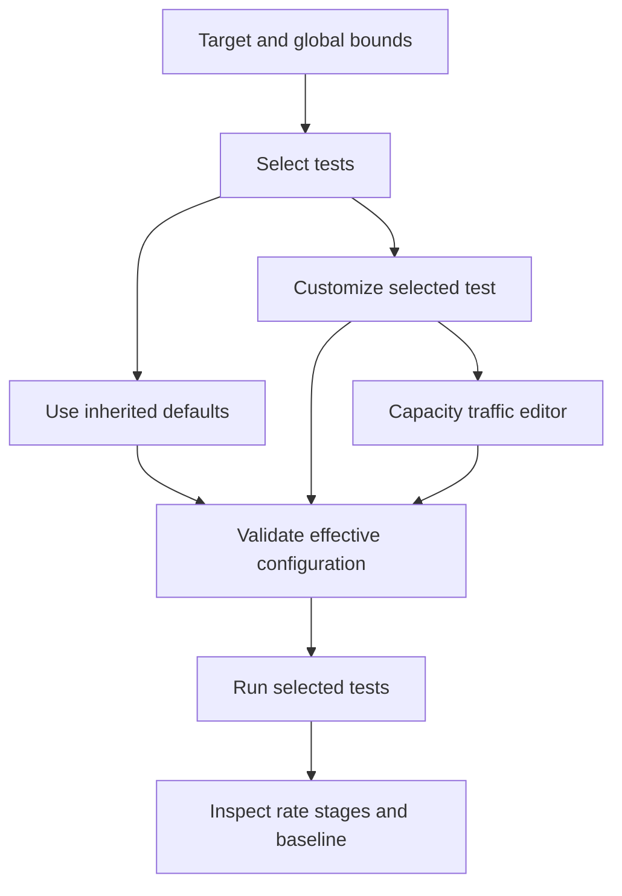
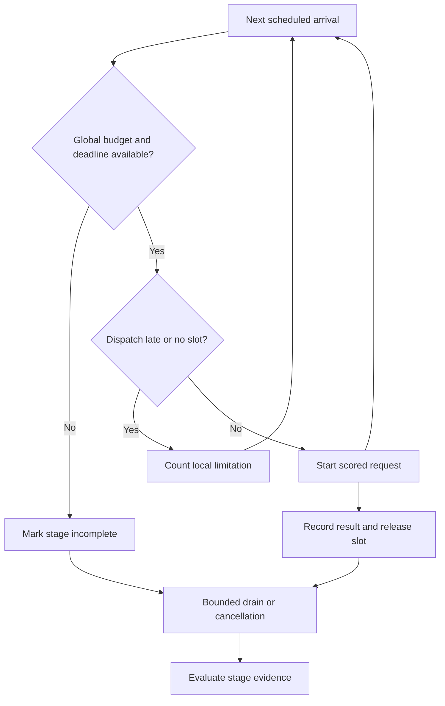

# Arrival Traffic and Test Controls - Plan

## Goal Capsule

**Objective:** An operator can determine the highest tested incoming request rate at which a deployment still gives correct, timely answers, and detect a capacity decrease after an upgrade.

**Means:** Extend the existing capacity check and local configuration UI using the shared contracts in KTD1–KTD7.

**Authority:** The user's requested behaviors govern the Product Contract; technical decisions implement that contract; units do not broaden either.

**Execution:** Implement the complete vertical slice in the existing repository. Preserve unrelated work. The user has authorized implementation after planning.

**Completion:** The parent integrator verifies the complete suite and obtains a fresh independent Brooks review score of at least 95 before reporting completion. Creating or merging a pull request is not part of this request.

---

## Product Contract

### Summary

Giraffe will offer selectable tests with visible defaults and per-test customization. Its capacity test will send a bounded, reproducible stream of mixed requests at configured arrival rates and report which tested rates satisfy the configured correctness and latency requirements.

### Problem Frame

The current capacity runner starts a wave and waits for the slowest request before starting another. Slow service consequently reduces the load generator's incoming traffic, concealing the waiting and errors an independently arriving workload would experience. Operators also need to run only relevant checks and change a check's workload or acceptance limits without rewriting the entire configuration.

### Requirements

**Traffic and evidence**

- R1. The capacity check sends arrivals according to elapsed time at one or more chosen rates without waiting for earlier requests to finish.
- R2. Operators can select steady or seeded uneven arrivals and configure a mix of short, long-input, and long-output requests with known-answer scoring.
- R3. Each tested rate reports offered and actual traffic, successful correct-and-timely throughput, timing distributions, failure rates, and early-to-late changes during the stage.
- R4. Reports distinguish local scheduling delay or load-generator limits from observed service response time; they never label client-observed delay as measured server queue time.
- R5. The highest acceptable tested arrival rate requires sufficient scored samples, configured user latency criteria, and the configured correctness and error limits; incomplete or generator-limited stages cannot establish capacity.
- R6. Upgrade comparisons identify a decrease in the highest acceptable tested rate only when workload, acceptance criteria, and measurement definitions are comparable.
- R7. Existing global request and duration budgets, error stops, and user cancellation remain effective, including when a stage has requests in flight.

**Selection and customization**

- R8. The UI lets operators select each supported check before starting a run, and deselected checks do not launch their dedicated workloads.
- R9. Every check exposes meaningful supported adjustments and a default mode inheriting the run settings; custom overrides affect that check only.
- R10. Capacity has a dedicated traffic editor showing rates, arrival distribution, mix, duration, and concurrency bounds before execution.
- R11. Configuration validation rejects unsupported, ignored, nonfinite, or unsafe parameter values before sending traffic.
- R12. UI forms, advanced JSON, CLI configurations, saved manifests, and baseline reuse describe the same effective selection and settings.

### Key Decisions

- **Keep infrastructure qualification focused.** Governs R2, R5, R6. Known-answer fixtures detect serving regressions; no application-agent evaluation is introduced.
- **Extend the existing capacity check.** Governs R1–R7. One capacity result avoids ambiguous competing interpretations in the UI.
- **Bound the generator without hiding pressure.** Governs R4, R5, R7. An arrival that cannot be dispatched immediately is counted explicitly instead of disappearing into a client queue.
- **Use sparse overrides.** Governs R9, R12. A default check inherits global settings, while customization stores only its supported differences.

### Key Flows

- F1. **Covers R8–R12.** Choose a target, select checks, leave defaults or customize an individual check, inspect the resulting bounds, and start the existing runner.
- F2. **Covers R1–R7.** Run finite rate stages, inspect each stage's accepted or rejected evidence, then compare an explicitly selected baseline under the same workload and criteria.

The existing setup view retains its target and global limits. The test-suite region becomes selectable cards with Default/Custom controls; the capacity card expands the traffic editor. The run view displays the selected checks and a per-rate results table.

### Acceptance Examples

- AE1. **Covers R1.** With a slow request still running, later arrivals start on schedule while capacity remains available; there is no batch-completion barrier.
- AE2. **Covers R4, R5.** A stage offering more requests than the generator's in-flight bound admits records its local drops and cannot pass as deployment capacity.
- AE3. **Covers R3, R5.** HTTP-successful requests with wrong answers or late answers do not count toward goodput.
- AE4. **Covers R8, R9.** Selecting only correctness with a custom sample count launches that workload and any explicitly required setup, but no capacity, context, cancellation, recovery, or generation workloads.
- AE5. **Covers R9, R12.** A customized check survives configuration save and reload; choosing Default removes its override and restores inherited values.
- AE6. **Covers R6.** Changing traffic mix, stage rates, timeout, or acceptance criteria produces an explicit non-comparable baseline result rather than an apparent upgrade regression.
- AE7. **Covers R7.** Stopping a run during arrivals or drain cancels its tasks and leaves a truthful partial result.

### Scope Boundaries

The work covers the existing local UI, CLI, runner, fixtures, and reports. It does not add distributed load generators, external benchmark adapters, trace replay, automatic rate search, multi-turn agent evaluation, fleet management, or a general test-plugin framework. Exact server queue measurements require server instrumentation and are not inferred here.

### Assumptions

Short finite stages are a practical default demonstration, not a statistical guarantee about all production traffic. Operators set their own latency criteria and increase duration or samples when qualifying a real deployment. Repeated fixtures may benefit from caching; the report must describe the actual workload rather than claim a cache-cold benchmark.

---

## Planning Contract

Product Contract unchanged.

### Key Technical Decisions

- KTD1. **One validated configuration authority.** Implements R9–R12 in `models.py`. Keep `RunConfig.checks` as selection authority, add `traffic`, and add sparse `test_options`. Expose a central effective-check resolver and supported-field metadata for both runner and UI. Merge nested limits using only explicitly supplied fields. Reject a check or field that the runner would ignore.
- KTD2. **Preserve legacy intent.** Implements R8, R12. An omitted `checks` field selects the standard checks and enables JSON/GPU only through their legacy flags. An explicit check list executes the listed checks, including JSON/GPU; it cannot silently require a second toggle. Old reports remain readable with defaulted additive fields, while a suite-version change prevents comparison against obsolete capacity semantics.
- KTD3. **Clock-driven scheduling with no local work queue.** Implements R1, R4, R7 in a small `traffic.py` module. Generate a finite seeded schedule bounded to 100,000 arrivals, then use a monotonic clock, reserve an available in-flight slot synchronously, and start each request independently. Distinguish local-cap drops, excessive scheduler lateness, and arrivals not offered because a global bound stopped the stage. Validate that the profile has at most 100,000 expected arrivals; cap actual Poisson arrivals at 100,000 and mark overflow inconclusive. Drain only the admitted tasks under a finite deadline before the next stage.
- KTD4. **Score the whole mixed workload.** Implements R2, R3, R5. Add traffic-specific short-answer, long-input retrieval, and longer exact-copy output fixtures. Schedule fixture choice independently of completion order. Goodput counts completed, valid, correct requests satisfying every configured per-request SLO; its denominator is the offered stage duration. Report admitted/completed rates separately and qualify tail drain behavior explicitly.
- KTD5. **Stage evidence defines capacity.** Implements R3–R6. Store per-stage counters, local lag, service timing, schedule-relative timing, and finite time-window summaries. Capacity is the highest acceptable tested rate, never a discovered theoretical maximum. Missing latency criteria or insufficient data means capacity is inconclusive. Per-stage rejection reasons explain correctness, timing, errors, incomplete offering, and generator limits separately.
- KTD6. **Compare planned traffic and effective criteria.** Implements R6, R12. Save the effective traffic and per-check settings in the manifest; compare these, suite definitions, and target identity using the existing baseline path. Do not require completed-request fixture proportions to match: selective failure itself changes those proportions. Retain existing safeguards against claiming timing improvements from less output work.
- KTD7. **Use existing UI patterns.** Implements R8–R12. Render native labeled controls and progressive disclosure inside the current setup form. Default mode omits overrides; custom mode exposes only applicable fields. Keep global safety bounds distinct from per-test settings and show backend validation errors near the configuration workflow.

### Shared Configuration Contract

`traffic` has the following fields. Numbers must be finite.

| Field | Default | Validation and meaning |
|---|---|---|
| `rates` | `[1, 2, 4]` | One to sixteen distinct increasing rates, each greater than zero and at most 10,000 requests/s |
| `duration_seconds` | `5` | Positive, at most 3,600; duration of each rate stage |
| `arrival` | `steady` | `steady` or `poisson` |
| `max_in_flight` | `null` | Optional integer 1–256; inherit global concurrency, never exceed it |
| `seed` | `42` | Nonnegative integer |
| `mix` | short 0.6, long_input 0.2, long_output 0.2 | Nonnegative weights, positive sum; normalize for sampling |
| `scheduler_lag_tolerance_ms` | `100` | Positive maximum acceptable local dispatch lateness |
| `drain_timeout_seconds` | `30` | Positive drain deadline, also bounded by the global deadline |
| `long_input_chars` | `4096` | Integer 128–1,000,000 |
| `long_output_words` | `32` | Integer 2–4,096 |

`test_options` maps check IDs to supported optional fields. Use `samples`, `concurrency`, `context_limit`, `max_output_tokens`, `request_timeout_seconds`, `sustained_seconds`, `metrics_max_age_seconds`, `cancel_after_ms`, `deadline_probe_ms`, and nested `limits` only where they change that check's executed behavior. Check-specific concurrency, token limits, and request timeout cannot exceed the corresponding global ceiling. The backend's field map is authoritative; unsupported nested limits must also be rejected.

Shared access/serving/first-output observations must not advertise independent workload controls that actually change another check's probes. Expose their meaningful timeout or acceptance criteria instead. GPU exposes metrics freshness and uses the existing target metrics URL. Traffic workload controls belong to `traffic`, while capacity's acceptance overrides belong to `test_options.capacity.limits`.

### Evidence and Lifecycle

Add defaulted optional request fields for stage index, offered rate, scheduled offset, and dispatch lag. Aggregate local drops without pretending an HTTP request started. A stage records scheduled, started, completed, failed, local drops, late drops, and exact not-offered counts. Enforce `scheduled = started + dropped_local + dropped_late + not_offered`; global request admission counts offered arrivals including local drops. Store these counters alongside its configured rate, observation duration, achieved rate, goodput, correctness, latency distributions, peak in flight, coverage, acceptance, and reasons. Use finite arrival-cohort windows to reveal growth in outstanding requests, errors, and response latency.

### Research Basis

The existing implementation is `src/giraffe/runner.py`'s grouped request path and the shared Pydantic contracts in `src/giraffe/models.py`. The product boundaries are in `PRODUCT.md`. The local setup and run surfaces are `src/giraffe/web.py` and `src/giraffe/static/`.

[vLLM's benchmark documentation](https://docs.vllm.ai/en/latest/benchmarking/cli/) informed scheduled arrival and workload accounting decisions in KTD3. [Inference Perf's goodput definition](https://github.com/kubernetes-sigs/inference-perf/blob/main/docs/goodput.md) informed the SLO filter in KTD4; Giraffe additionally requires a known-answer score. These sources establish useful measurement practice, not a claim that this feature is novel.

---

## Implementation Units

### U1. Configuration and selected-check execution

**Owner:** Backend worker.

**Goal:** Make every accepted configuration field affect only its selected check.

**Requirements:** R8–R12; AE4, AE5.

**Dependencies:** None.

**Files:** `src/giraffe/models.py`, `src/giraffe/runner.py`, `src/giraffe/fixtures.py`, `tests/test_models.py`, `tests/test_runner.py`, `tests/test_fixtures.py`.

**Approach:** Implement KTD1, KTD2, and the shared contract first. Pass effective settings through workload and verdict paths. Limit initial probes to access, first-output, and an explicitly requested restart; limit warm probes to serving, first-output, and the fairness baseline. Capacity-only runs emit only their mixed arrivals; cancellation and recovery use only their own probes. Keep safety counters centralized.

**Test scenarios:**

1. Covers AE4: a correctness-only run starts no unrelated scenarios, and its custom samples are observable in sent requests.
2. Explicit JSON/GPU selection enables execution; an omitted list preserves legacy opt-in behavior.
3. Nested acceptance overrides inherit unspecified global values and do not change sibling checks.
4. Unknown checks, ignored fields, invalid weights/rates, nonfinite numbers, and out-of-ceiling overrides fail validation before network activity.
5. Cancellation timing and metrics freshness customizations reach the relevant check.

**Verification:** Selected-check integration tests and old configuration fixtures pass under the new shared resolver.

### U2. Continuous arrival scheduler

**Owner:** Traffic worker.

**Goal:** Offer mixed traffic independently of request completion and account honestly for every scheduled arrival.

**Requirements:** R1–R7; AE1–AE3, AE7.

**Dependencies:** U1's shared contract.

**Files:** `src/giraffe/traffic.py`, `tests/test_traffic.py`; coordinate the callback boundary with U1.

**Approach:** Implement KTD3–KTD5 as one bounded scheduler and stage evaluator. Backend callbacks reserve shared budgets and slots without waiting, execute through the existing client and scorer, and release resources in a finalizer. The scheduler owns arrival timing and bounded task lifetime.

**Test scenarios:**

1. Covers AE1: request start timestamps remain scheduled while earlier requests are pending.
2. Seeded Poisson arrivals and fixture choices reproduce across runs.
3. Covers AE2: no-slot and excessive-lag drops are counted separately and invalidate capacity without exceeding concurrency.
4. Covers AE3: wrong, failed, timed-out, and SLO-missing requests never enter goodput.
5. Covers AE7: stop, global deadline, request budget, and drain expiry leave no tasks behind and cannot produce a full-coverage pass.
6. Window summaries expose increasing latency or outstanding requests in a deliberately overloaded fake service.
7. Large rate/duration profiles fail validation beyond 100,000 expected arrivals; bounded actual Poisson overflow is inconclusive and request budgets stop dispatch with exact remaining counts.

**Verification:** Deterministic scheduler tests and a real loopback fake-endpoint scenario prove timing independence, boundedness, and complete accounting.

### U3. Capacity integration and scored fixtures

**Owner:** Backend worker.

**Goal:** Replace the old capacity sweep with scored finite rate stages.

**Requirements:** R1–R7; AE2, AE3.

**Dependencies:** U1, U2.

**Files:** `src/giraffe/runner.py`, `src/giraffe/fixtures.py`, `tests/test_runner.py`, `tests/test_fixtures.py`, `tests/test_generation.py`.

**Approach:** Invoke U2 from the capacity scenario using KTD4's fixtures and effective limits. Preserve shared stop/error budgets and model-overlap semantics. Store effective settings, staged observations, and a bumped suite version.

**Test scenarios:**

1. Each workload class has an enforceable score and a materially different input or output workload.
2. Missing latency criteria and insufficient stage samples yield inconclusive capacity.
3. A fake service with known overload behavior accepts a lower rate and rejects a higher rate for the observed reason.
4. Overlapping targets respect the existing global limits without hidden semaphore waiting in traffic stages.

**Verification:** End-to-end reports contain the actual offered and admitted workload, per-stage verdicts, and highest acceptable tested rate.

### U4. Results and upgrade comparison

**Owner:** Reporting worker.

**Goal:** Present capacity evidence and comparable upgrade changes without false precision.

**Requirements:** R3–R6, R12; AE6.

**Dependencies:** U1, U2 metric contract.

**Files:** `src/giraffe/reporting.py`, `tests/test_reporting.py`, and new traffic-reporting tests owned by the reporting worker.

**Approach:** Extend existing report output and comparison using KTD5, KTD6. Show per-rate outcomes and separate generator limitations from service failures. Preserve legacy report loading.

**Test scenarios:**

1. Matching workloads with reduced highest acceptable rate report the capacity decrease.
2. Covers AE6: changed mix, rates, duration, seed, settings, or criteria prevent a capacity regression claim.
3. Failed or locally dropped requests do not disappear because comparison inspects only successful records.
4. Old reports remain viewable and are explicitly incompatible with the new capacity definition.

**Verification:** Text/JSON report and baseline tests agree on capacity meaning and comparison eligibility.

### U5. Selectable tests and configuration UI

**Owner:** UI worker.

**Goal:** Let operators select and customize the exact run before traffic starts.

**Requirements:** R8–R12; AE4, AE5.

**Dependencies:** U1 metadata and U2 report contract.

**Files:** `src/giraffe/web.py`, `src/giraffe/static/index.html`, `src/giraffe/static/app.js`, `src/giraffe/static/styles.css`, `tests/test_web.py`.

**Approach:** Implement KTD7 using server-provided field metadata. Keep selection, form state, JSON state, save/load, and baseline reuse consistent. Provide a dedicated capacity profile and readable stage results.

**Test scenarios:**

1. Covers AE4: selecting one check submits only that selection and shows its workload settings.
2. Covers AE5: switching Custom/Default, disabling/re-enabling, and JSON/save/reload preserve the intended effective configuration.
3. An empty selection or invalid traffic value produces an actionable validation error with no run.
4. Keyboard navigation reaches checkboxes, mode controls, and traffic settings; disabled state remains legible.
5. A loopback UI run displays traffic stages and baseline capacity comparison from actual server responses.

**Verification:** Web contract tests and a browser smoke confirm the visible controls drive the saved and executed configuration.

---

## Verification Contract

The integrator owns `tests/test_arrival_end_to_end.py`, extensions to `tests/fake_endpoint.py`, and documentation. The backend worker retains ownership of existing backend end-to-end tests. The integrator runs `.venv/bin/python -m pytest -q` and `.venv/bin/ruff check src tests` after integration. New scheduler and selected-check tests must demonstrate the behavior in AE1–AE7, including a loopback HTTP test rather than timing mocks alone. Run the local UI against a fake endpoint to verify selection, default/custom edits, traffic configuration, and report display. Document the new CLI/YAML fields and the meaning of goodput, local drops, and highest tested rate in `README.md` and an example configuration.

A new reviewer, uninvolved in design or implementation, must apply the `brooks-review` skill to the complete diff. The reviewer should report actual evidence and the resulting score, with no request to inflate it. Resolve findings and repeat independent review as needed until the score is at least 95. This review is in addition to functional tests, not a substitute for them.

---

## Definition of Done

- R1–R12 are implemented through the same shared runner, with AE1–AE7 exercised.
- All repository tests and lint checks pass, and the browser smoke verifies the edited configuration reaches execution.
- Reports distinguish incomplete testing from endpoint failure and never present generator limits as deployment capacity.
- Existing configuration and report compatibility is explicitly tested; documentation describes the new semantics.
- Abandoned approaches and temporary experiment code are removed from the final diff.
- A fresh independent Brooks review scores the completed implementation at least 95, and any remaining limitations are stated accurately.
